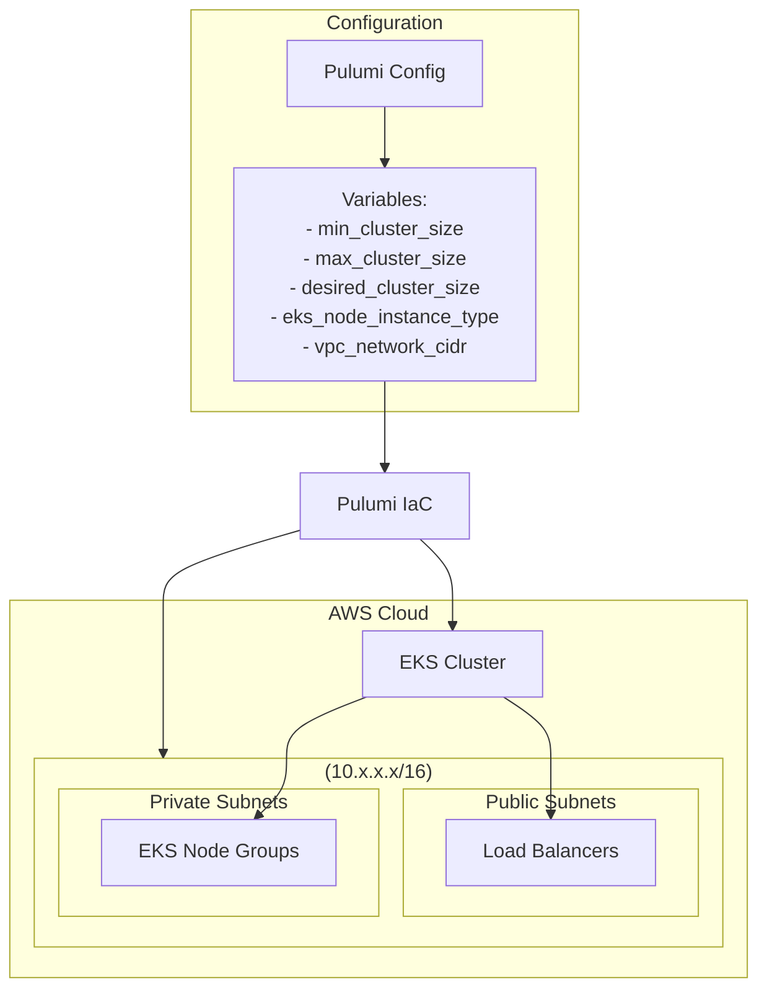

# Kubernetes Workshop with Pulumi

This project contains a series of workshop exercises designed to teach you how to deploy and manage Kubernetes resources using Pulumi. The workshop covers everything from creating an Amazon EKS cluster to deploying applications using Helm charts and managing Custom Resource Definitions (CRDs).

## What Are We Trying to Do?

Our goal is to provide a comprehensive learning path for using Pulumi to manage Kubernetes infrastructure and applications. We accomplish this by:

- **Creating an Amazon EKS cluster** with a properly configured VPC and node groups.
- **Deploying basic Kubernetes resources** like Namespaces and Deployments.
- **Using Helm charts** to deploy complex applications with Pulumi.
- **Managing Custom Resource Definitions (CRDs)** with strongly-typed Pulumi classes.

This setup allows developers and DevOps engineers to learn Infrastructure as Code (IaC) principles with Pulumi in a Kubernetes context.

## Architecture Diagram

The following Mermaid diagram illustrates the high-level architecture of the EKS cluster created in the first exercise:



## Requirements

- **Pulumi CLI** – for managing infrastructure as code.
- **Python 3** – the runtime environment.
- **uv** – for Python dependency management (faster alternative to pip and venv).
- **AWS CLI** – configured with appropriate credentials.
- **Access to an AWS Account** – to provision the resources.
- **kubectl** – for interacting with Kubernetes clusters.
- **crd2pulumi** – for Exercise 4 (CRD management).

## Workshop Structure

The workshop is divided into four progressive exercises:

### Exercise 1: Creating an Amazon EKS Cluster

Learn how to create a complete Amazon EKS cluster with a properly configured VPC, subnets, and node groups. This exercise covers:

- Creating a VPC with public and private subnets
- Deploying an EKS cluster with configurable node groups
- Setting up a Kubernetes provider for interacting with the cluster

### Exercise 2: Deploying Basic Kubernetes Resources

Build upon Exercise 1 by deploying standard Kubernetes resources to your EKS cluster:

- Creating a Kubernetes Namespace
- Deploying an NGINX application from a YAML manifest
- Understanding how to manage Kubernetes resources with Pulumi

### Exercise 3: Deploying Applications with Helm Charts

Explore different approaches to deploying applications using Helm charts with Pulumi:

- Using the kubernetes.helm.v3.Chart resource for simpler deployments
- Using the kubernetes.helm.v3.Release resource for more complex scenarios
- Understanding the differences and trade-offs between these approaches

### Exercise 4: Managing Custom Resources (CRDs)

Learn how to manage Kubernetes Custom Resource Definitions (CRDs) using Pulumi:

- Using crd2pulumi to generate strongly-typed Python classes from cert-manager CRDs
- Deploying cert-manager using Helm
- Creating and managing custom resources (ClusterIssuer, Certificate) using the generated types

## Setup and Deployment

1. **Clone the Repository**

```sh
git clone https://github.com/pulumi-demos/kubernetes-workshop.git
cd kubernetes-workshop
```

2. **Set Up Python Environment**

This project uses [uv](https://github.com/astral-sh/uv) for Python dependency management. uv is a fast, reliable Python package installer and resolver that serves as a replacement for pip and virtualenv.

If you don't have uv installed, you can install it with:

```sh
# Install uv using pip (works on most platforms)
pip install uv

# Or using Homebrew (for macOS users)
brew install uv
```

Then set up your environment with uv:

```sh
# Create and activate a virtual environment
uv venv
source .venv/bin/activate  # On Windows: .venv\Scripts\activate

# Install dependencies from pyproject.toml (uv.lock ensures consistent versions)
uv pip install --no-deps -e .
```

3. **Configure Pulumi**

Make sure you have Pulumi installed and configured on your machine. Then, set up your AWS credentials:

```sh
pulumi config set aws:region <your-aws-region>
```

4. **Deploy the EKS Cluster (Exercise 1)**

```sh
pulumi up
```

Confirm the changes, and Pulumi will provision the EKS cluster and all associated resources.

5. **Follow Each Exercise**

Navigate to the respective exercise directory and follow the instructions in the README.md file:

```sh
cd workshops/exercise-01-eks
# Follow instructions in README.md
```

## How It Works

- **Virtual Private Cloud (VPC):**  
  The VPC is created with public and private subnets across multiple availability zones. Public subnets are used for load balancers, while private subnets host the EKS node groups.

- **EKS Cluster:**  
  The EKS cluster is deployed within the VPC with API authentication mode for access entries. It's configured with customizable node instance types and scaling parameters.

- **Kubernetes Resources:**  
  Various Kubernetes resources are deployed to the cluster, including namespaces, deployments, and services, demonstrating how to manage Kubernetes resources with Pulumi.

- **Helm Charts:**  
  Applications are deployed using Helm charts, showcasing different approaches to managing Helm releases with Pulumi.

- **Custom Resources:**  
  Custom Resource Definitions (CRDs) are managed using strongly-typed Pulumi classes generated from cert-manager CRDs, demonstrating how to work with custom resources in a type-safe manner.

- **Python Dependency Management with uv:**  
  This project uses [uv](https://github.com/astral-sh/uv) for Python dependency management. uv is configured as the toolchain in the Pulumi.yaml file, which means Pulumi will use uv to manage Python dependencies instead of pip and virtualenv. The project includes a uv.lock file that ensures consistent dependency versions across different environments. When you run Pulumi commands, it will automatically use uv to install and manage dependencies defined in pyproject.toml.
